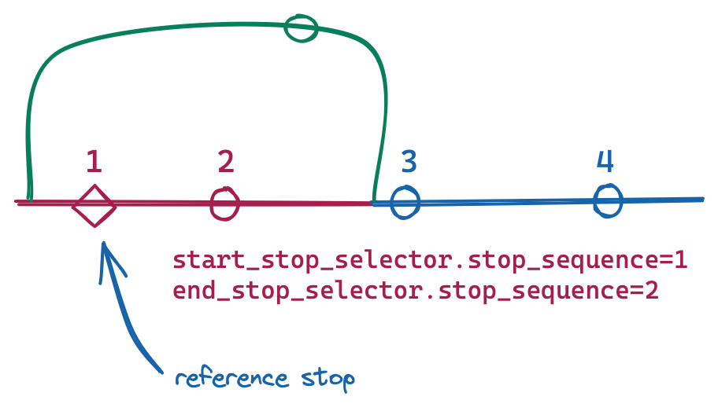

# Trip Modifications

A `TripModifications` message identifies a list of similar `trip_ids` from the (CSV) GTFS sharing the same stop pattern, which are all affected by a particular modification, such as a detour. 

## SLO: Service-level objective

The frequency of data updates is expected to be approximately hourly (~24 times/day). Ingestion time may depend on the total number of affected trips. Consumers are expected to ingest a single TripModification within 5 minutes, and a feed with hundreds of detours within 20 minutes. 

## TripModifications

The modification is in effect on all of the listed service\_dates, until it is removed from the feed. On any given service date, a trip MUST NOT be assigned to more than one `TripModifications` object. 

There MAY be multiple `TripModifications` for a given stop pattern. It may be desirable to split the trips into multiple modifications e.g. if the `propagated_modification_delay` changes significantly, over the course of the detour.

Each affected trip is deemed to be canceled and replaced with a new trip. The affected trip can be omitted from the feed while it is detoured.  Each replacement trip has an automatically generated ID and shares all of the properties defined in trips.txt for the affected trip it replaced. Replacement trip IDs can be used in the same way as any other trip\_id in GTFS-RT. For example, TripUpdates can be provided using the replacement trip ID.

The stop times of each replacement trip are created from those of the affected trip, by performing the changes listed in modifications. Stop sequences are assigned from 1 to n, ignoring the stop\_sequence values of the affected stop times. If a particular stop time is not affected by the detour, all other values will match those originally defined in stop\_times.txt.

##  Modification

A `Modification` message replaces a span of n stop times (`num_stops_replaced`) from each affected trip starting at `start_stop_sequence`. The spans of the modifications MUST not overlap. Spans may not be contiguous; in this case the two modifications MUST be merged into one.  These stop times are replaced with a new stop time for each replacement stop described by `replacement_stops`.

The sequence of `replacement_stops` may be of arbitrary length. For example, 3 stops could be replaced by 2, 4, or 0 stops as the situation may require. 

_An example showing the effect of a modification on a particular trip. This modification may also be applied to several other trips._

_Propagated detour delays affect all stops following the end of a modification. If a trip has multiple modifications, the delays are accumulated._

## ReplacementStop

Each `ReplacementStop` message acts as a template for generating a new stop time in each modified trip. The generated stop time will have the specified `stop_id`. 
The `arrival_time` is calculated from a reference stop in the original trip, plus the offset in `travel_time_to_stop`. The `departure_time` always equals the `arrival_time`.
The optional fields of [`stop_times.txt`](https://github.com/google/transit/blob/master/gtfs/spec/en/reference.md#stop_timestxt) in the (CSV) GTFS specification are all set to their default values.

_If a modification affects the first stop of the trip, that stop also serves as the reference stop of the modification._

## Shape

Describes the physical path that a vehicle takes when the shape is not part of the (CSV) GTFS, such as for an ad-hoc detour. Shapes belong to Trips and consist of an encoded polyline for more efficient transmission.  Shapes do not need to intercept the location of Stops exactly, but all Stops on a trip should lie within a small distance of the shape for that trip, i.e. close to straight line segments connecting the shape points

## Stop

Represent a new Stop added to the feed dynamically. All fields are as described in the (CSV) GTFS specification. Location type of the new stop is assumed to be `0` (routable stop). 

